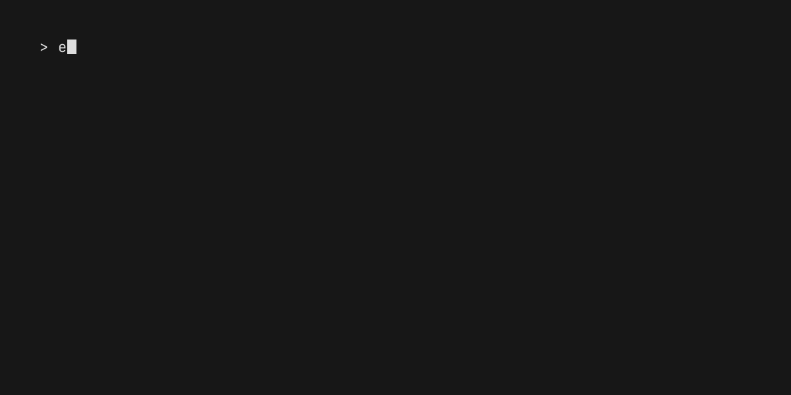

# vhs-rs

**Agent-first terminal automation: VHS-compatible tapes, assertions, screenshots, and GIFs — no browser, no ffmpeg.**



vhs-rs executes [VHS](https://github.com/charmbracelet/vhs)-style `.tape` scripts against a **real PTY**, models the screen with an offscreen terminal emulator ([avt](https://crates.io/crates/avt)), and rasterizes PNG/GIF output itself. It is a single static binary with zero runtime dependencies — no Chromium, no ttyd, no ffmpeg.

The primary consumer is an **AI coding agent** that writes a tape, runs it, and uses the results as evidence: meaningful exit codes, a machine-readable JSON report, plain-text screen captures, automatic failure forensics, and deterministic output you can diff. Humans watching GIFs are the secondary audience.

### vhs-rs vs VHS

|                      | VHS                                            | vhs-rs                                                        |
| -------------------- | ---------------------------------------------- | ------------------------------------------------------------ |
| Runtime dependencies | Chromium + ttyd (+ ffmpeg for video)           | none — single static binary                                  |
| `Wait` mechanism     | polls xterm.js via JS eval every 10 ms         | event-driven: regex re-checked on each PTY output chunk      |
| Assertions           | none                                           | `Assert[+Screen\|+Line][@timeout] /re/` → exit 1 on mismatch |
| Machine output       | prose on stderr                                | `--json` run report on stdout                                |
| Exit codes           | coarse; render errors can be swallowed         | 0/1/2/3/4 taxonomy; every error propagates                   |
| `.mp4` / `.webm`     | yes (via ffmpeg)                               | no (dropped — see [support matrix](#command-support-matrix)) |
| Screenshots          | PNG                                            | PNG + automatic plain-text `.txt` sibling                    |

## Quickstart

Build (requires a Rust toolchain; runtime needs only a Unix system with `bash`):

```sh
cargo build --release
# → target/release/vhs-rs
```

Write a tape:

```
# hello.tape
Output demo.gif

Type "echo hello from vhs-rs"
Enter
Wait

Assert /hello from vhs-rs/
Screenshot proof.png
```

Run it:

```sh
vhs-rs run hello.tape          # execute (also: `vhs-rs hello.tape`)
vhs-rs run --json hello.tape   # same, with a JSON report on stdout
vhs-rs check hello.tape        # parse + validate only, no execution
echo 'Type "date"' | vhs-rs run -   # read the tape from stdin
```

This produces `demo.gif` (animated), `proof.png` (screenshot), and `proof.txt` (the same screen as plain text — the artifact an agent actually reads).

## The agent contract

Everything in this section is stable API: exit codes, the JSON report shape, forensics file naming, and the determinism guarantees.

### Exit codes

| Code | Meaning                                              |
| ---- | ---------------------------------------------------- |
| 0    | success                                              |
| 1    | `Assert` failure                                     |
| 2    | parse/validation error (also from `vhs-rs check`)     |
| 3    | `Wait` timeout                                       |
| 4    | runtime error (I/O, PTY, missing `Require` binary)   |

### `--json` run report

`vhs-rs run --json` prints exactly one JSON object on stdout. Real output from the quickstart tape above (comments annotate; they are not part of the output):

```jsonc
{
  "version": 1,                    // report schema version
  "tape": "hello.tape",
  "status": "success",             // success | assert_failed | parse_error
                                   //   | wait_timeout | runtime_error
  "exit_code": 0,                  // matches the process exit code
  "duration_ms": 3657,
  "term": { "cols": 77, "rows": 21, "shell": "bash" },
  "commands": [                    // one record per executed command
    { "index": 0, "line": 1, "col": 1,
      "command": "Output .gif demo.gif", "status": "ok", "elapsed_ms": 0 },
    { "index": 1, "line": 3, "col": 1,
      "command": "Type echo hello from vhs-rs", "status": "ok", "elapsed_ms": 1070 },
    { "index": 2, "line": 4, "col": 1,
      "command": "Enter 1", "status": "ok", "elapsed_ms": 51 },
    { "index": 3, "line": 5, "col": 1,
      "command": "Wait Line", "status": "ok", "elapsed_ms": 0,
      "detail": {                  // Wait/Assert carry their outcome
        "elapsed_ms": 0, "matched": true, "regex": ">$", "scope": "Line" } },
    { "index": 4, "line": 7, "col": 1,
      "command": "Assert Screen hello from vhs-rs", "status": "ok", "elapsed_ms": 0,
      "detail": { "matched": true, "regex": "hello from vhs-rs", "scope": "Screen" } },
    { "index": 5, "line": 8, "col": 1,
      "command": "Screenshot proof.png", "status": "ok", "elapsed_ms": 6,
      "detail": { "path": "proof.png" } }
  ],
  "artifacts": [                   // every file the run produced
    { "path": "proof.png", "kind": "png",  "command_index": 5 },
    { "path": "proof.txt", "kind": "text", "command_index": 5 },
    { "path": "demo.gif",  "kind": "gif" } // end-of-run outputs have no index
  ]
}
```

On failure the report gains a `failure` object and the failing command's `detail` includes `screen_text` — the exact text that was on screen at check time, so an agent can see *why* the pattern missed without opening any file:

```jsonc
{
  "status": "assert_failed",
  "exit_code": 1,
  "commands": [
    // ...,
    { "index": 5, "command": "Assert Screen status: 42", "status": "failed",
      "detail": { "matched": false, "regex": "status: 42", "scope": "Screen",
                  "screen_text": "> echo status: 41\nstatus: 41\n>\n..." } }
  ],
  "failure": {
    "command_index": 5,            // which command failed
    "reason": "assert_failed",     // assert_failed | wait_timeout | runtime_error
    "message": "Assert /status: 42/ did not match Screen"
  },
  "artifacts": [
    { "path": "fail.failure.txt", "kind": "failure_text" },
    { "path": "fail.failure.png", "kind": "failure_png" }
  ]
}
```

`vhs-rs check --json` prints `{"ok": bool, "commands": N, "errors": [{"line", "col", "message"}]}`.

### Failure forensics — always on

On **any** failure (assert, wait timeout, runtime error) vhs-rs writes two files next to your outputs, no flags required:

- `<stem>.failure.txt` — the final screen as plain text
- `<stem>.failure.png` — the same screen, rendered

`<stem>` is the first `Output` path with its extension removed (e.g. `Output build/demo.gif` → `build/demo.failure.txt`); if the tape has no `Output`, the tape filename minus `.tape` is used. Both paths are listed in the JSON report's `artifacts`.

### Screenshot's text sibling

Every `Screenshot foo.png` also writes `foo.txt` with the same screen as plain text — the agent's cheapest input, no vision model needed. The sibling swaps the extension, so don't give a `Screenshot` the same stem as an `Output something.txt`. `Capture bar.txt` writes text only, with no PNG.

### Determinism

Two runs of the same tape produce **byte-identical `.txt` artifacts** — diffing them is your regression signal (this repo's own golden test suite, `tests/golden.rs`, is exactly that). Guaranteed by pinning:

- shell: `bash --noprofile --norc -i` (or `sh -i` / `zsh -f -i` / `fish --no-config -i` via `Set Shell`)
- environment: `TERM=xterm-256color`, `PS1="> "` (matches the default `WaitPattern` `>$`), `PROMPT_COMMAND=`, `HISTFILE=`, `LANG=LC_ALL=C.UTF-8`, plus `VHS_RS=1` so scripts can detect they're under automation
- an **implicit initial Wait** for the prompt before the first command, eliminating the classic race where typing starts before the shell is up

One caveat: the rest of the environment is inherited from the parent process. If a command's output depends on an inherited variable, pin it in the tape — e.g. `Env LS_COLORS "di=01;34:ex=01;32"` before using `ls --color`.

## Tape language

The grammar is VHS's, with three extensions (`Assert`, `Capture`, `Output .cast`). Existing `.tape` files parse unchanged; `vhs-rs check` flags anything vhs-rs cannot execute, with `line:col` caret errors.

### Command support matrix

**Supported (VHS-compatible)**

| Command | Notes |
| --- | --- |
| `Type[@speed] "text"` | per-character, PTY echo settles between chars |
| `Enter`, `Space`, `Tab`, `Backspace`, `Delete`, `Insert`, `Escape` | all accept `[@speed] [count]` |
| `Up` `Down` `Left` `Right`, `PageUp` `PageDown`, `Home` `End` | application-cursor mode (vim, fzf) handled automatically |
| `Ctrl+X`, `Alt+X`, `Shift+X`, chords like `Ctrl+Shift+O` | modifiers before the key |
| `Sleep <time>` | keeps draining output, so GIF timestamps stay accurate |
| `Wait[+Line\|+Screen][@timeout] [/re/]` | event-driven; defaults: scope **Line**, pattern `WaitPattern`, timeout `WaitTimeout` |
| `Screenshot x.png` | + automatic `x.txt` text sibling |
| `Hide` / `Show` | gate GIF frames |
| `Require <bin>` | checked before spawning anything; missing → exit 4 |
| `Env KEY "value"` | only before the first action command |
| `Source other.tape` | one level deep; inner `Source`/`Output` filtered |
| `Copy "text"` / `Paste` | **internal clipboard only** — deviation from VHS, never touches the system clipboard |
| `Output x.gif` / `x.txt` / `x.ascii` / `x.test` | `.txt`-family is VHS's golden format: full screen after every command + `─`×80 separator |
| `Set <setting> <value>` | see [settings](#settings) |

**New in vhs-rs**

| Command | Notes |
| --- | --- |
| `Assert[+Screen\|+Line][@timeout] /re/` | regex required; default scope **Screen**; immediate check, or retries event-driven until `@timeout`; mismatch → exit 1 + forensics |
| `Capture x.txt` | dump the current screen as plain text, immediately |
| `Output x.png` | final frame as PNG |
| `Output x.cast` | asciicast v3 (asciinema) event log |

**Conditional**

- `ScrollUp` / `ScrollDown` — sent as SGR mouse-wheel events **when the child program has enabled mouse reporting** (vim, fzf, htop, …). If it hasn't, the command warns and is a no-op: a plain shell has no scrollback to move in a fixed screen.

**Dropped** (rejected by `vhs-rs check`, exit 2)

- `Output x.mp4` / `x.webm` — video encoding requires ffmpeg; out of scope for a zero-dependency binary. Generate a `.gif` or `.cast` instead
- `Output frames/` (PNG frame directories)
- `Set FontFamily` — vhs-rs renders with an embedded JetBrains Mono; ignored with a warning

### Quirks worth knowing

- **Quote absolute paths.** A leading `/` starts a regex token, so `Screenshot /tmp/x.png` is a parse error — write `Screenshot "/tmp/x.png"`.
- **`Wait` defaults to scope `Line`** (the cursor's row — right for "the prompt is back"); **`Assert` defaults to scope `Screen`** (right for "the output appeared somewhere"). Override with `+Line`/`+Screen`.
- **Mid-tape `Set` is restricted.** Terminal geometry is fixed once the shell spawns, so after the first action command only `TypingSpeed`, `WaitTimeout`, `WaitPattern`, `PlaybackSpeed`, and `Theme` may be `Set`; anything else is a `check`-time error (VHS silently ignores these — vhs-rs refuses).
- Strings take `"`, `'`, or `` ` `` quotes with **no escape sequences**, so `Type "printf '\e[31mred\e[0m\n'"` sends the backslashes literally to the shell. Adjacent string literals after one `Type` are joined with a single space.
- `Wait` without a regex uses the current `WaitPattern`; `Assert` always requires a regex.

### Settings

Defaults are VHS's. "Mid-tape" marks the settings allowed after commands have started.

| Setting | Default | Mid-tape | Notes |
| --- | --- | --- | --- |
| `Shell` | `bash` | no | `bash`/`sh`/`zsh`/`fish` get pinned no-config flags; anything else runs verbatim |
| `Width` × `Height` | 1200 × 600 | no | canvas pixels; cols/rows derive from font metrics |
| `Padding` | 60 | no | |
| `Margin` / `MarginFill` | 0 / theme background | no | `MarginFill` takes `#rrggbb` |
| `WindowBar` / `WindowBarSize` | none / 30 | no | `Colorful`, `ColorfulRight`, `Rings`, `RingsRight` |
| `BorderRadius` | 0 | no | |
| `FontSize` | 22 | no | |
| `LineHeight` | 1.0 | no | |
| `LetterSpacing` | 1.0 | no | pixels (xterm.js semantics) |
| `TypingSpeed` | 50ms | yes | per-keystroke delay |
| `PlaybackSpeed` | 1.0 | yes | GIF time scaling |
| `Framerate` | 50 | no | GIF max fps, capped at 50 |
| `WaitTimeout` | 15s | yes | default deadline for `Wait`/`Assert@` |
| `WaitPattern` | `>$` | yes | default regex for `Wait` (matches the pinned `PS1`) |
| `Theme` | VHS default (dark) | yes | 348 built-in names (`Set Theme "Dracula"`) or inline JSON |
| `CursorBlink` | `true` | no | blinking block cursor in GIFs (530ms cadence, frames synthesized during idle) |
| `LoopOffset` | 0% | no | start the GIF loop N% into the timeline (`Set LoopOffset 20%`) |
| `FontFamily` | — | — | parsed, ignored with a warning (embedded font) |

## Examples

All in [`examples/`](examples/), all pass `vhs-rs check`:

- [`demo.tape`](examples/demo.tape) — shell session to GIF + screenshot
- [`agent-check.tape`](examples/agent-check.tape) — the core agent workflow: run, wait, assert, capture text evidence
- [`tui.tape`](examples/tui.tape) — drives a full-screen TUI (vi): insert text, save, verify from the shell
- [`theme-gallery.tape`](examples/theme-gallery.tape) — one run, several themes via mid-tape `Set Theme`
- [`failure-demo.tape`](examples/failure-demo.tape) — deliberately failing `Assert` demonstrating exit 1 + forensics

## Credits

- [charmbracelet/vhs](https://github.com/charmbracelet/vhs) (MIT) — the tape language, defaults, and `themes.json`; vhs-rs's parser is a faithful port of VHS's
- [asciinema](https://github.com/asciinema/asciinema) — the [avt](https://crates.io/crates/avt) terminal emulator and the PTY-handling patterns vhs-rs's session engine is modeled on; `Output .cast` follows asciicast v3
- [JetBrains Mono](https://www.jetbrains.com/lp/mono/) (Nerd Font build, embedded) — [SIL OFL 1.1](assets/fonts/OFL.txt)
