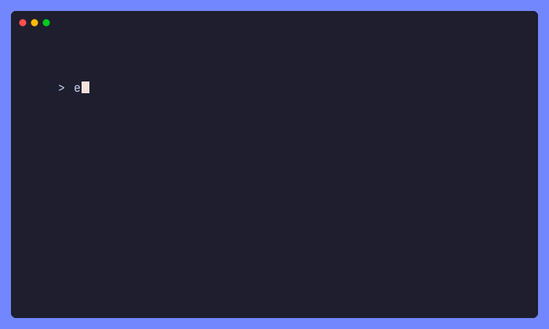
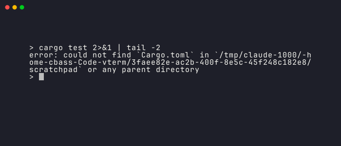

# vhs-rs

<p>
  
  <br>
  <a href="https://github.com/cbxss/vhs-rs/actions"></a>
</p>

Script your terminal, test what it shows, and get a GIF to prove it. One binary,
no browser, no ffmpeg.

The GIF above was made by vhs-rs ([view source](examples/readme.tape)).

vhs-rs runs [VHS](https://github.com/charmbracelet/vhs)-style `.tape` files in a
real terminal: it types your commands into a PTY, waits for output to appear,
asserts on it, and renders what happened as a GIF, PNG, or plain text. It was
built with AI agents in mind — exit codes mean something, every run can emit a
JSON report, and failures leave a screenshot behind — but it's a perfectly good
way for a human to make demo GIFs too.

## Tutorial

Create a tape file:

```elixir
# demo.tape
Output demo.gif

Set Theme "Catppuccin Mocha"
Set WindowBar Colorful

# Type a command.
Type "echo 'Welcome to vhs-rs!'"

# Run it.
Enter

# Wait for the prompt to come back. No sleeps, no guessing —
# this blocks until the shell is actually done.
Wait

# Prove the output is what you think it is.
Assert /Welcome to vhs-rs/

# Take a picture, then linger a moment for the GIF.
Screenshot proof.png
Sleep 2s
```

Run it:

```sh
vhs-rs demo.tape
```

That's it. You get `demo.gif`, `proof.png`, and `proof.txt` — the screenshot's
plain-text twin, which is the file a script (or an agent) actually wants to read.

A few more ways to invoke it:

```sh
vhs-rs run --json demo.tape        # same run, JSON report on stdout
vhs-rs check demo.tape             # parse + validate only, runs nothing
echo 'Type "date"' | vhs-rs run -  # tape from stdin
```

## Testing terminal programs

`Wait` and `Assert` are the whole story. `Wait` blocks until a regex matches
the screen (checked every time the program writes output — there is no polling
loop and no fixed sleep to tune). `Assert` checks the screen right now and
fails the run if the pattern isn't there.

```elixir
Type "cargo test 2>&1 | tail -2"
Enter
Wait                                  # prompt is back = command finished
Assert+Screen /test result: ok/       # fail the run otherwise
Capture evidence.txt                  # plain-text copy of the screen
```

When something fails — an assert misses, a wait times out, the program
crashes — vhs-rs writes two files next to your outputs before exiting:
`<stem>.failure.txt` and `<stem>.failure.png`, the final screen as text and
as an image. No flags, it just happens.



Exit codes tell you what went wrong without reading anything:

| code | meaning |
| ---- | ------- |
| 0 | success |
| 1 | an `Assert` failed |
| 2 | the tape didn't parse (`vhs-rs check` uses this too) |
| 3 | a `Wait` timed out |
| 4 | runtime error (I/O, PTY, missing `Require` binary) |

## For agents

This is the part built for scripts and AI agents driving vhs-rs in a loop.
The exit codes, JSON shape, forensics naming, and determinism rules below are
stable API.

`vhs-rs run --json` prints one JSON object on stdout: a record per command
(with line numbers and timing), every artifact written, and on failure the
exact screen text at the moment the check ran — so the caller can see *why* a
pattern missed without opening a single file.

```jsonc
{
  "version": 1,
  "tape": "demo.tape",
  "status": "assert_failed",        // success | assert_failed | parse_error
  "exit_code": 1,                   //   | wait_timeout | runtime_error
  "term": { "cols": 77, "rows": 21, "shell": "bash" },
  "commands": [
    { "index": 3, "line": 9, "col": 1, "command": "Wait Line",
      "status": "ok", "elapsed_ms": 132 },
    { "index": 4, "line": 11, "col": 1, "command": "Assert Screen status: 42",
      "status": "failed",
      "detail": { "matched": false, "regex": "status: 42", "scope": "Screen",
                  "screen_text": "> echo status: 41\nstatus: 41\n>" } },
    { "index": 5, "line": 12, "col": 1, "command": "Screenshot proof.png",
      "status": "skipped" }          // commands after a failure are skipped
  ],
  "failure": { "command_index": 4, "reason": "assert_failed",
               "message": "Assert /status: 42/ did not match Screen" },
  "artifacts": [
    { "path": "demo.failure.txt", "kind": "failure_text" },
    { "path": "demo.failure.png", "kind": "failure_png" }
  ]
}
```

`vhs-rs check --json` prints `{"ok", "commands", "errors": [{"line", "col", "message"}]}`.

Two runs of the same tape produce byte-identical `.txt` artifacts — diff them
and you have a regression test (this repo's own test suite does exactly that,
see [`tests/golden.rs`](tests/golden.rs)). vhs-rs makes this hold by pinning
the shell (`bash --noprofile --norc -i`), the prompt (`PS1="> "`, which the
default `Wait` pattern matches), `TERM`, and the locale, and by waiting for
the prompt before the first keystroke. It also sets `VHS_RS=1` in the child so
your scripts can tell they're being recorded.

One caveat: everything else in the environment is inherited. If a command's
output depends on some variable, pin it in the tape:

```elixir
Env LS_COLORS "di=01;34:ex=01;32"
```

## Installation

You'll need a Rust toolchain to build, and a Unix system with `bash` to run.

```sh
git clone https://github.com/cbxss/vhs-rs && cd vhs-rs
cargo build --release
# → target/release/vhs-rs (~8 MB, no runtime dependencies)
```

## The tape language

The grammar is VHS's — existing tapes parse unchanged, and `vhs-rs check`
flags anything it can't execute with `line:col` caret errors. Three commands
are new, a couple behave differently, and video output is gone. Details:

### Supported

`Type`, every key (`Enter`, `Tab`, `Backspace`, arrows, `PageUp`/`PageDown`,
`Home`/`End`, …) with `[@speed] [count]`, chords (`Ctrl+Shift+O`, `Alt+.`),
`Sleep`, `Wait[+Line|+Screen][@timeout] [/re/]`, `Screenshot`, `Hide`/`Show`,
`Require`, `Env`, `Source`, `Copy`/`Paste`, `Output .gif/.txt/.ascii/.test`,
and `Set` for the full VHS settings list. Arrow keys respect application
cursor mode, so vim and fzf behave.

### New

| command | what it does |
| --- | --- |
| `Assert[+Screen\|+Line][@timeout] /re/` | fail the run (exit 1) if the pattern isn't on screen; with `@timeout` it retries until the deadline |
| `Capture x.txt` | dump the screen as plain text, right now |
| `Output x.cast` | asciicast v3 event log ([asciinema](https://asciinema.org) format) |
| `Output x.png` | final frame as a PNG |

### Different or dropped

- `Output x.mp4` / `x.webm` — dropped; video needs ffmpeg, which is the kind
  of dependency this project exists to not have. Make a `.gif` or `.cast`.
- `Copy`/`Paste` use an internal clipboard, never the system one.
- `Set FontFamily` is accepted but ignored — the font is embedded
  (JetBrains Mono, with a Nerd Font symbols fallback so powerline glyphs work).
- `ScrollUp`/`ScrollDown` send real mouse-wheel events when the program has
  enabled mouse reporting (vim, htop, fzf); otherwise they warn and do nothing.

### Things that will bite you exactly once

- Quote absolute paths: `/` starts a regex, so it's `Screenshot "/tmp/x.png"`.
- `Wait` defaults to scope `Line` (the cursor's row — right for "is the prompt
  back"). `Assert` defaults to `Screen` (right for "did it print anywhere").
- Strings have no escape sequences. `Type "printf '\n'"` sends a literal
  backslash-n to the shell, which is usually what you want.
- After the first action command, only `TypingSpeed`, `WaitTimeout`,
  `WaitPattern`, `PlaybackSpeed`, and `Theme` may be `Set` — the terminal's
  geometry is fixed once the shell spawns. VHS silently ignores late setting
  changes; vhs-rs makes them a `check` error.

### Settings

Defaults match VHS: 1200×600 canvas, padding 60, font size 22, typing speed
50ms, wait timeout 15s, wait pattern `>$`. Plus `Theme` (348 built-in names or
inline JSON), `WindowBar` (`Colorful`, `ColorfulRight`, `Rings`, `RingsRight`),
`BorderRadius`, `Margin`/`MarginFill`, `LetterSpacing`, `LineHeight`,
`Framerate` (GIF max fps, capped at 50), `PlaybackSpeed`, `LoopOffset`,
`CursorBlink` (on by default), and `Shell` (`bash`, `sh`, `zsh`, `fish` — each
spawned with its no-config flags).

## How is this different from VHS?

VHS records a headless Chromium rendering xterm.js served by ttyd, and
stitches frames with ffmpeg. That works, and its GIFs are lovely, but it's a
lot of machinery — and it can't assert on anything, its `Wait` polls the
browser every 10ms, and a failed render can still exit 0.

vhs-rs keeps the tape language and does the terminal work itself:

|  | VHS | vhs-rs |
| --- | --- | --- |
| runtime deps | Chromium, ttyd, ffmpeg | none |
| `Wait` | polls via JS eval | event-driven, re-checked per output chunk |
| assertions | — | `Assert`, exit code 1 |
| machine output | prose on stderr | `--json` report |
| failure artifacts | — | screen dumped as `.txt` + `.png`, always |
| `.mp4`/`.webm` | yes | no |

## Examples

All in [`examples/`](examples/), all pass `vhs-rs check`:

- [`demo.tape`](examples/demo.tape) — shell session to GIF + screenshot
- [`agent-check.tape`](examples/agent-check.tape) — run, wait, assert, capture
- [`tui.tape`](examples/tui.tape) — drives vi: insert text, save, verify
- [`theme-gallery.tape`](examples/theme-gallery.tape) — several themes, one run
- [`failure-demo.tape`](examples/failure-demo.tape) — a deliberate failure and
  the forensics it leaves behind
- [`readme.tape`](examples/readme.tape) — the GIF at the top of this page

## Credits

vhs-rs stands on three excellent projects:
[charmbracelet/vhs](https://github.com/charmbracelet/vhs) (the tape language,
the default look, and the theme catalog — the parser here is a faithful port),
[asciinema](https://github.com/asciinema/asciinema) (the
[avt](https://crates.io/crates/avt) terminal emulator at the core of the
screen model, the PTY patterns, and the asciicast format), and
[JetBrains Mono](https://www.jetbrains.com/lp/mono/) (embedded under the
[SIL OFL 1.1](assets/fonts/OFL.txt), with
[Nerd Fonts](https://github.com/ryanoasis/nerd-fonts) symbols as fallback).

MIT licensed.
